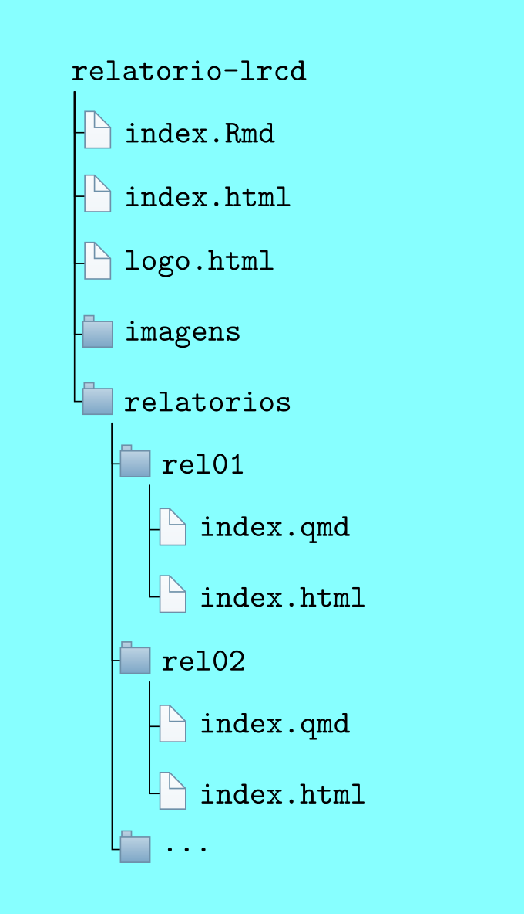
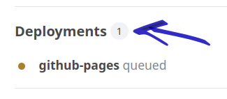
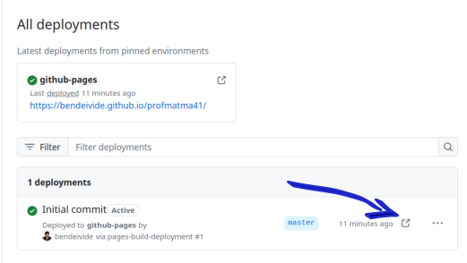

--- 

<center>


```{=html}
<div id="htmlwidget-81753beecf80e781089a" style="width:600px;height:200px;" class="r2d3 html-widget"></div>
<script type="application/json" data-for="htmlwidget-81753beecf80e781089a">{"x":{"data":null,"type":"NULL","container":"svg","options":null,"script":"var d3Script = function(d3, r2d3, data, svg, width, height, options, theme, console) {\nthis.d3 = d3;\n\nsvg = d3.select(svg.node());\n/* R2D3 Source File:  imagens/d3/voronoi/voronoi.js */\n// !preview r2d3 d3_version = 4\n\n// Based on: https://bl.ocks.org/mbostock/4060366\n// Based on: r2d3 package in gallery\n\nsvg.on(\"touchmove mousemove\", moved);\n\nvar sites = d3.range(100)\n    .map(function(d) { return [Math.random() * width, Math.random() * height]; });\n\nvar voronoi = d3.voronoi()\n    .extent([[-8, -8], [width + 8, height + 8]]);\n\nvar polygon = svg.append(\"g\")\n    .attr(\"class\", \"polygons\")\n  .selectAll(\"path\")\n  .data(voronoi.polygons(sites))\n  .enter().append(\"path\")\n    .call(redrawPolygon);\n\nvar link = svg.append(\"g\")\n    .attr(\"class\", \"links\")\n  .selectAll(\"line\")\n  .data(voronoi.links(sites))\n  .enter().append(\"line\")\n    .call(redrawLink);\n\nvar site = svg.append(\"g\")\n    .attr(\"class\", \"sites\")\n  .selectAll(\"circle\")\n  .data(sites)\n  .enter().append(\"circle\")\n    .attr(\"r\", 2.5)\n    .call(redrawSite);\n\nfunction moved() {\n  sites[0] = d3.mouse(this);\n  redraw();\n}\n\nfunction redraw() {\n  var diagram = voronoi(sites);\n  polygon = polygon.data(diagram.polygons()).call(redrawPolygon);\n  link = link.data(diagram.links()), link.exit().remove();\n  link = link.enter().append(\"line\").merge(link).call(redrawLink);\n  site = site.data(sites).call(redrawSite);\n}\n\nfunction redrawPolygon(polygon) {\n  polygon\n      .attr(\"d\", function(d) { return d ? \"M\" + d.join(\"L\") + \"Z\" : null; });\n}\n\nfunction redrawLink(link) {\n  link\n      .attr(\"x1\", function(d) { return d.source[0]; })\n      .attr(\"y1\", function(d) { return d.source[1]; })\n      .attr(\"x2\", function(d) { return d.target[0]; })\n      .attr(\"y2\", function(d) { return d.target[1]; });\n}\n\nfunction redrawSite(site) {\n  site\n      .attr(\"cx\", function(d) { return d[0]; })\n      .attr(\"cy\", function(d) { return d[1]; });\n}\n};","style":"/* R2D3 Source File:  imagens/d3/voronoi/voronoi.css */\n.links {\n  stroke: #000;\n  stroke-opacity: 0.2;\n}\n\n.polygons {\n  fill: none;\n  stroke: #000;\n}\n\n.polygons :first-child {\n  fill: blue;\n}\n\n.sites {\n  fill: #000;\n  stroke: #fff;\n}\n\n.sites :first-child {\n  fill: #fff;\n}","version":4,"theme":{"default":{"background":"#FFFFFF","foreground":"#000000"},"runtime":null},"useShadow":true},"evals":[],"jsHooks":[]}</script>
```

</center>


# Página dos alunos da disciplina

- Acesse: [Página dos alunos da disciplina Estatística Aplicada a Inovações tecnológicas](https://bendeivide.github.io/courses/eait){target="_blank"}

# Visão geral sobre os relatórios {.tabset .tabset-fade}

Este projeto está disponível em <https://github.com/bendeivide/relatorio-eait.git>.

## O que é necessário?

- Instalar o R: 
  - Windows: <https://cran.r-project.org/bin/windows/base/>
    - rtools: <https://cran.r-project.org/bin/windows/Rtools/>
  - MAC: <https://cran.r-project.org/bin/macosx/>
  - Linux: <https://cran.r-project.org/bin/linux/>
- Instalar o RStudio: <https://www.rstudio.com/products/rstudio/download/>
- Instalar o Git: <https://git-scm.com/downloads>
- Fazer o cadastro no GitHub:
  - Crie um cadastro em: <https://github.com/signup?source=login>
  - Guarde o e-mail utilizado e o seu nome de usuário. Por exemplo, em meu github:
    - Nome: *bendeivide*
      - O seu pode ser encontrado no canto superior direito de sua imagem. Ao clicar na seta ao lado, aparecerá um menu, e a primeira informação é: "*Signed in as nome_usuario*". Esse é o seu nome de usuário ("*nome_usuario*")
    - E-mail: *ben.deivide@gmail.com*
      - Ainda no canto superior direito de sua imagem, no github, ao clicar na seta ao lado, tem uma opção chamada "*Settings*", clique nessa opção, e aparecerá a página de configurações. Na lateral direita, procure por: *Access* > *Emails* > *Primary email address*. Pronto, este é o seu e-mail!
- Instalar Pacotes (No R): 


``` r
pkgs <- c("rmarkdown", "knitr", "bookdown", "tinytex", "postcards", "usethis", "gitcreds", "quarto", "r2d3")
install.packages(pkgs)
```

- Autenticação e sincronização do RStudio com o Github


``` r
# Configurando o nome e email do github
usethis::use_git_config(user.name = "YourName", user.email = "your@mail.com")
# gerando um token
usethis::create_github_token() 
# inserindo o token no arquivo '.Renviron'
usethis::edit_r_environ()
## armazene seu token na varivel GITHUB_PAT:
## GITHUB_PAT=ghp_XXXXXXXXXXXXXXXXXXXXXX
## após inserir esta linha de comando, finalize o arquivo
## acrescentando uma nova linha!!!!

# Criar localmente o projeto git
usethis::use_git()
# Subi o projeto local ao github
usethis::use_github()
```


## Diretório/Repositório

A estrutura base de nossos relatórios deve seguir a seguinte estrutura de diretório:

- Usando RStudio -> GitBash (Via terminal)
  - Configure o terminal da seguinte forma:
    - *RStudio* > *Tools* > *Global Options...* > *Terminal* > *General* > *Shell* > *New Terminal open with*: *Git Bash* > *Apply* (Botão)
- Crie um repositório no [GitHub](https://github.com) com o nome `relatorio-estexp`;
- Ao ser criado o repositório GitHub, precisamos copiar o https desse repositório:
  - Entre no repositório > Procure o botão "Code" > Copie o __HTTPS__ . Se considerarmos o nome do repositório como "relatorio-estexp" seria isso:hhhhh `https://github.com/<seunome_github>/relatorio-estexp.git`
- Clone no RStudio esse repositório em:
  - *File > New Project... > Version Control > Git > Repository URL*:
  - Insira o *https* do repositório Git;
  - Escolha o diretório onde esse repositório será clonado em seu computador em: "*Create project as subdirectory of*". Lembre-se de escolher diretórios (pastas) com nomes sem acento, com espaços. De preferência, crie uma pasta no disco C com no "repos", isto é, `C:/repos`^[Pensando no SO Win.]. Caminhos longos dificultam a renderização do projeto. Experiência pessoal!

---

## GitHub/RStudio

Para sincronizarmos as alterações do nosso repositório local com o repositório GitHub, faremos a sequência de comandos:

- Usando o *Git Bash* (Pela aba *Terminal* no RStudio)
  - Adicionar todas as alterações no projeto (localmente)
  - Comentar a alteração (localmente)
  - Enviar as alterações para o respositório `https://github.com/seunome_github/relatorio-estexp`
  - Nessa ordem, temos os comandos:
  
```github
$ git add .
$ git commit -m "Comentário a ser inserido!"
$ git push
```
Podemos também fazer esses passos por meio de botões no RStudio. No terceiro quadrante, procure pela aba *Git*, depois o botão *Commit*. Ao clicar, abrirá uma nova janela. No seu lado esquerdo será apresentado todos os arquivos alterados. Selecione os arquivos que deseja subi para o GitHub. Ao selecionar, no seu lado direito, haverá um espaço, em *commit message*, para realizar o comentário, vulgarmente chamamos *commitar*. Feito isso, clique no botão *commit*, e depois no botão *push*. Pronto, alterações enviadas!

---

## Estrutura do repositório

A estrutura de nosso projeto será da seguinte forma:




- `relatorio-lrcd/index.html` é a página principal. Sempre use `index.Rmd` para renderizar a página em HTML;
- `images` é o subdiretório que criamos algumas imagens. Para as imagens necessárias nos relatórios, insira nos diretórios dos relatórios;
- `index.html` é o arquivo que representa a página das informações adicionais de cada aluno. Sempre use `index.Rmd` para renderizar a página em HTML. Caso deseje alterar a foto `logo.png` por uma sua, insira a imagem na raiz do projeto, a respectiva imagem, renomeando-a por `logo.png`, lembre-se da extensão da imagem, `.png`;
- Todos os subdiretórios `./rel0X` representam os locais para desenvolver os relatórios. Para `X = 1`, isto é, `./rel01`, temos o desenvolvimento do relatório 1, e assim sucessivamente. Para a criação de mais relatórios, copie um desses subdiretórios como modelo para o desenvolvimento do próximo. Por exemplo, se criarmos o relatório 03, copie um dos subdiretórios referidos, e renomei-o como `./rel03`. Sempre use `index.Rmd` para renderizar a página em HTML. 

## Implantação da página

- Uma vez projeto local no github, vamos ativar a página:
  - No repositório `relatorio-estexp`, acesse configurações (*settings*);
  - Em geral (*general*) > código e automação (*code and automation*) > Página (*Pages*);
  - Em construção e implantação (*Build and deployment*) da página, acesse a *branch*;
  - no botão *none* escolha (*master* ou *main*) de acordo como está o seu projeto;
  - posteriormente, o diretório será *roots*, e clique em salvar (*save*);
  - retorne ao diretório do projeto no github (`seunome_github/relatorio-estexp`);
  - no lado direto inferior da página aparecerá a opção *Deployments* (Caso não apareça, espere um pouco ou limpe o *cache* do seu navegador), clique-o! (Figura \@ref(fig:deploy01));
  - Agora verifique a página e veja se está tudo certo! (Figura \@ref(fig:deploy02));
  - Pronto! Estando tudo certo, a página pode ser acessada com o link: `https://seunome.github.io/relatorio-estexp`. Bons estudos!

<div class="figure" style="text-align: center">

<p class="caption">(\#fig:deploy01)Construindo a página.</p>
</div>
  
  
<div class="figure" style="text-align: center">

<p class="caption">(\#fig:deploy02)Verificando a página.</p>
</div>
  

---

# Relatórios {#relatorio}

Para *linkar* os relatórios basta usar o código (Exemplo Relatório 01):

```
- [Relatorio 01 (Insira a data)](rel01/index.html){target="_blank"}
```
Relatórios desenvolvidos:

- [Relatório 01 (24/08/2026)](rel01/index.html){target="_blank"}
- [Relatório 02 (31/08/2026)](rel02/index.html){target="_blank"}
- [Relatório 03 (07/09/2026)](rel03/index.html){target="_blank"}
- [Relatório 04 (28/09/2026)](rel04/index.html){target="_blank"}
- [Relatório 05 (05/10/2026)](rel05/index.html){target="_blank"}
- [Relatório 06 (xx/xx/xxxx)](rel05/index.html){target="_blank"}
- ...
